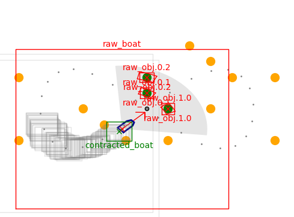

# ROS2 Interval Analysis

This package integrates [Codac.io](https://codac.io/) Interval Analysis with ROS2 for real-time contraction on robotic systems.

<div style="text-align: center;">
Example of real-time localisation using an online ROS2 interval contractor.

<br> <a href="#run-the-online-contractor-example">You can try it here after installation</a> 
</div>

## Dependencies

#### Codac library:

* https://codac.io/install/01-installation.html

#### ROS (Tested on Humble):

* https://docs.ros.org/en/humble/Installation.html

## Installation

To install the required ROS messages for Codac objects such as `Interval`, `Box` (`IntervalVector`), and `Tube`, follow these steps:

### Clone and Build the Repository

Navigate to your ROS2 workspace and clone the repository:

```bash
cd ~/ros2_workspace/src/
git clone https://github.com/Noceo200/ros2-interval-analysis.git
cd ..
colcon build
source install/setup.bash
```

### Verify that ROS Messages are installed correctly
To check if the messages are correctly installed, start a simple publisher:
```bash
ros2 run interval_analysis_examples simple_publisher
```
Then, in another terminal, subscribe to the topic:
```bash
ros2 run interval_analysis_examples simple_subscriber
```
If the setup is correct, the subscriber should display the messages published by the publisher.

## Run the online contractor example

This real-time contractor is based on the theory described in the following Codac.io tutorials:
* <a href="https://codac.io/tutorial/03-static-rangebearing/index.html">Static range-and-bearing localization</a> 
* <a href="https://codac.io/tutorial/05-tubes/index.html">Hello tubes</a>


### Running the simulation:
First, start the boat simulation:
```bash
ros2 run interval_analysis_boat_simu boat_simu
```
Then, launch the online localization contractor, which uses range, bearing, and speed constraints:
```bash
ros2 run interval_analysis_examples localisation_range_bearing_deriv
```
This will process the simulated sensor data and apply interval-based constraints for real-time localization.

